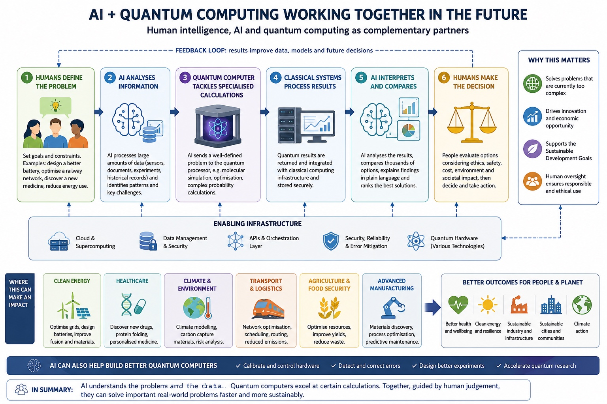
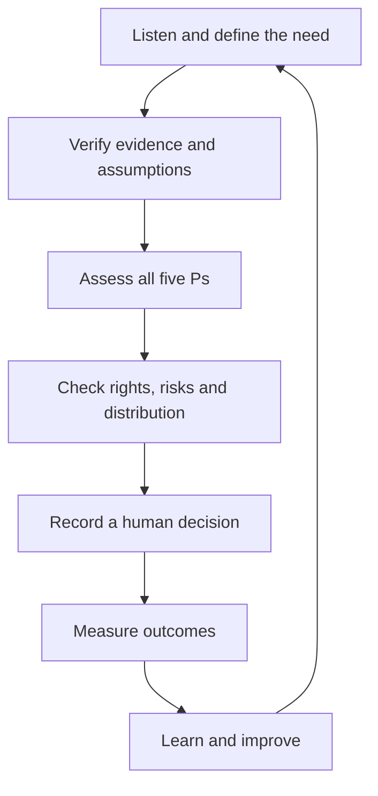

# HESI–5P Innovation Model

**Human-centred, Evidence-led, Sustainable and Inclusive innovation assessed through People, Planet, Prosperity, Peace and Partnership.**

> Working draft 0.1 · August 2026 · Project author: Eoin Potts



## Purpose

The HESI–5P Innovation Model is a practical framework for designing, assessing and improving innovation. It is intended for technology, artificial intelligence, organisational change, public services, infrastructure, health, sustainability and community projects.

The model begins with a simple principle:

> Innovation should strengthen people and communities, protect the planet, create fair prosperity, uphold rights and public trust, and be developed through partnership.

HESI–5P does not treat technical performance as the only measure of success. It combines evidence, human judgement, rights, inclusion, sustainability and measurable outcomes.

## The HESI principles

| Principle | Meaning | Core test |
| --- | --- | --- |
| **Human-centred** | People define the need, participate in design and retain final responsibility for consequential decisions. | Does this improve people's lives while protecting dignity, safety, autonomy and rights? |
| **Evidence-led** | Decisions use reliable evidence, transparent assumptions, appropriate comparison and continuous evaluation. | Can the claims, benefits, risks and uncertainties be independently examined? |
| **Sustainable** | Environmental, social and economic effects are considered across the full life cycle. | Does the innovation create lasting value without shifting harm to other places, people or generations? |
| **Inclusive** | Diverse people can participate, access the benefits and challenge decisions that affect them. | Who may be excluded, burdened or left behind, and what will be done about it? |

## The five-P assessment

| Lens | Desired outcome | Example considerations |
| --- | --- | --- |
| **People** | Dignity, health, education, equality and wellbeing | Safety, accessibility, skills, human rights and distribution of benefits |
| **Planet** | Protected climate, water, land, resources and ecosystems | Energy, carbon, water, materials, waste, biodiversity and resilience |
| **Prosperity** | Fair and durable economic and social value | Decent work, productivity, affordability, innovation and local opportunity |
| **Peace** | Rights, justice, safety and trustworthy institutions | Accountability, security, privacy, transparency, redress and public confidence |
| **Partnership** | Shared knowledge, responsibility and delivery | Co-design, affected communities, research, public bodies, business and civil society |

The five Ps are mutually dependent. A project should not claim success under one lens while concealing serious harm under another.

## Decision pathway



1. **Listen and define the need.** Identify affected people, the public-interest purpose, constraints and alternatives.
2. **Verify evidence and assumptions.** Check data quality, provenance, limitations, uncertainty and conflicts of interest.
3. **Assess all five Ps.** Record intended benefits, possible harms, trade-offs and evidence for every lens.
4. **Check rights, risks and distribution.** Examine equality, accessibility, privacy, safety, security and who receives the benefits or burdens.
5. **Record a human decision.** Name the accountable decision-maker, reasons, safeguards, conditions and route for challenge.
6. **Measure outcomes.** Use an agreed baseline, indicators, targets and disaggregated results where appropriate.
7. **Learn and improve.** Publish or share findings, involve affected groups and revise, pause or stop the project when evidence requires it.

## Minimum assessment record

Every HESI–5P assessment should document:

- the problem, desired outcome and option of taking no action;
- affected people and how they participated;
- the evidence used, its provenance and its limitations;
- benefits, harms and trade-offs across all five Ps;
- equality, accessibility, rights, safety, privacy and security controls;
- environmental and resource effects across the life cycle;
- the accountable human decision-maker and route for review or redress;
- indicators, baselines, targets, review dates and stop conditions; and
- learning that will feed into the next decision cycle.

## Human accountability rule

AI, analytics, simulation and quantum computing may collect, test, compare, flag, model and recommend. They must not be presented as the accountable authority for consequential legal, employment, welfare, health, safety or ecological decisions.

People must retain meaningful control, understand the material evidence and uncertainty, record the reasons for a decision, and remain answerable for its effects.

## Initial case study

The first worked application explores a complementary partnership between human intelligence, AI, classical computing and quantum computing:

- [AI + Quantum Computing Working Together](docs/case-studies/ai-quantum-computing.md)

The case study treats quantum computing as a specialised component rather than a replacement for people, AI or classical systems. It also distinguishes proposed future value from demonstrated present-day outcomes.

## Possible applications

- responsible AI and AI assurance;
- organisational and public-service change;
- health technology and research;
- clean energy and climate resilience;
- transport, logistics and infrastructure;
- agriculture and food security;
- sustainable communities and local planning; and
- advanced manufacturing and materials research.

## Repository structure

```text
hesi-5p-innovation-model/
├── README.md
├── assets/
│   └── ai-quantum-hesi-5p-infographic.jpeg
└── docs/
    └── case-studies/
        └── ai-quantum-computing.md
```

## Responsible use

HESI–5P is a working innovation and governance framework. It is not a certification, a guarantee of sustainability, or a substitute for legal, scientific, technical, clinical, equality or environmental assessment.

An organisation using the model should make evidence available at a level appropriate to the decision, invite scrutiny, declare unresolved uncertainty and commission independent evaluation for high-impact work.

## Relationship to sustainable development

The five-P structure reflects the integrated approach of the United Nations 2030 Agenda: People, Planet, Prosperity, Peace and Partnership. Alignment must be demonstrated through outcomes and evidence; mentioning a Sustainable Development Goal does not itself prove a positive contribution.

See the [United Nations Sustainable Development Goals](https://sdgs.un.org/goals).

## Status, attribution and licensing

This is a concept-stage working draft for testing and refinement. A formal open-source or content licence has not yet been selected. Before public release, confirm ownership and reuse permission for every image and external contribution, then add an appropriate licence and attribution notice.

Suggested citation:

> Potts, E. (2026). *HESI–5P Innovation Model* (Working draft 0.1).

