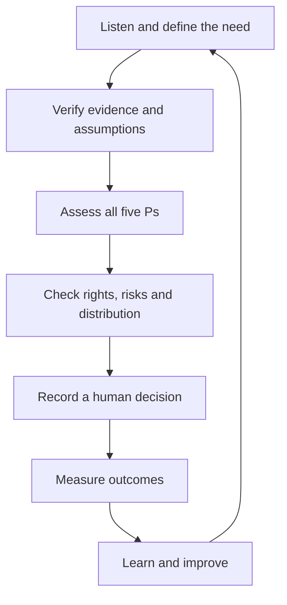

# HESI–5P Innovation Model

**Human-centred, Evidence-led, Sustainable and Inclusive innovation assessed through People, Planet, Prosperity, Peace and Partnership.**

> Working draft 0.3 · 19 August 2026 · Project author: Eoin Potts


[Read the text explanation of the infographic](docs/case-studies/ai-quantum-computing.md).

## At a glance

| Question | Answer |
| --- | --- |
| **What is HESI–5P?** | A decision and evaluation framework for responsible innovation. |
| **Who can use it?** | Communities, charities, public bodies, researchers, project teams, policymakers and developers. |
| **What does it produce?** | A transparent record of evidence, benefits, harms, trade-offs, human responsibility and measurable outcomes. |
| **What is its status?** | Working draft 0.3 for testing, evaluation and improvement; it is not a certification or substitute for professional advice. |

## Start here

- [Responsible AI continuous learning loop](docs/responsible-ai-loop.md)
- [EU AI Act practical alignment guide](docs/eu-ai-act-alignment.md)
- [Sustainable Development Goal alignment guide](docs/sdg-alignment.md)
- [UK SDG Delivery Plan 2026–2030](docs/uk-sdg-delivery-plan-2026-2030.md)
- [AI + quantum-computing case study](docs/case-studies/ai-quantum-computing.md)
- [Applied strategy and governance resources](#applied-strategy-and-governance-resources)
- [Official reference register](REFERENCES.md)
- [Contribution guidance](CONTRIBUTING.md)
- [Accessibility approach](ACCESSIBILITY.md)

## Purpose

The HESI–5P Innovation Model is a practical framework for designing, assessing and improving innovation. It is intended for technology, artificial intelligence, organisational change, public services, infrastructure, health, sustainability and community projects.

The model begins with a simple principle:

> Innovation should strengthen people and communities, protect the planet, create fair prosperity, uphold rights and public trust, and be developed through partnership.

HESI–5P does not treat technical performance as the only measure of success. It combines evidence, human judgement, rights, inclusion, sustainability and measurable outcomes.

## The HESI principles

| Principle | Meaning | Core test |
| --- | --- | --- |
| **Human-centred** | People define the need, participate in design and retain final responsibility for consequential decisions. | Does this improve people's lives while protecting dignity, safety, autonomy and rights? |
| **Evidence-led** | Decisions use reliable evidence, transparent assumptions, appropriate comparison and continuous evaluation. | Can the claims, benefits, risks and uncertainties be independently examined? |
| **Sustainable** | Environmental, social and economic effects are considered across the full life cycle. | Does the innovation create lasting value without shifting harm to other places, people or generations? |
| **Inclusive** | Diverse people can participate, access the benefits and challenge decisions that affect them. | Who may be excluded, burdened or left behind, and what will be done about it? |

## The five-P assessment

| Lens | Desired outcome | Example considerations |
| --- | --- | --- |
| **People** | Dignity, health, education, equality and wellbeing | Safety, accessibility, skills, human rights and distribution of benefits |
| **Planet** | Protected climate, water, land, resources and ecosystems | Energy, carbon, water, materials, waste, biodiversity and resilience |
| **Prosperity** | Fair and durable economic and social value | Decent work, productivity, affordability, innovation and local opportunity |
| **Peace** | Rights, justice, safety and trustworthy institutions | Accountability, security, privacy, transparency, redress and public confidence |
| **Partnership** | Shared knowledge, responsibility and delivery | Co-design, affected communities, research, public bodies, business and civil society |

The five Ps are mutually dependent. A project should not claim success under one lens while concealing serious harm under another.

## Decision pathway



1. **Listen and define the need.** Identify affected people, the public-interest purpose, constraints and alternatives.
2. **Verify evidence and assumptions.** Check data quality, provenance, limitations, uncertainty and conflicts of interest.
3. **Assess all five Ps.** Record intended benefits, possible harms, trade-offs and evidence for every lens.
4. **Check rights, risks and distribution.** Examine equality, accessibility, privacy, safety, security and who receives the benefits or burdens.
5. **Record a human decision.** Name the accountable decision-maker, reasons, safeguards, conditions and route for challenge.
6. **Measure outcomes.** Use an agreed baseline, indicators, targets and disaggregated results where appropriate.
7. **Learn and improve.** Publish or share findings, involve affected groups and revise, pause or stop the project when evidence requires it.

For AI applications, the [HESI–5P Responsible AI Continuous Learning Loop](docs/responsible-ai-loop.md) expands this pathway into a repeating 12-stage governance cycle covering traceable evidence, options and risk analysis, the 8-Part Innovation Test, the Five Pillars, rights and accessibility, human deliberation, responsible delivery, outcome measurement, scheduled review and material-change reassessment.

## Minimum assessment record

Every HESI–5P assessment should document:

- the problem, desired outcome and option of taking no action;
- affected people and how they participated;
- the evidence used, its provenance and its limitations;
- benefits, harms and trade-offs across all five Ps;
- equality, accessibility, rights, safety, privacy and security controls;
- environmental and resource effects across the life cycle;
- the accountable human decision-maker and route for review or redress;
- indicators, baselines, targets, review dates and stop conditions; and
- learning that will feed into the next decision cycle.

## Human accountability rule

AI, analytics, simulation and quantum computing may collect, test, compare, flag, model and recommend. They must not be presented as the accountable authority for consequential legal, employment, welfare, health, safety or ecological decisions.

People must retain meaningful control, understand the material evidence and uncertainty, record the reasons for a decision, and remain answerable for its effects.

## Initial case study

The first worked application explores a complementary partnership between human intelligence, AI, classical computing and quantum computing:

- [AI + Quantum Computing Working Together](docs/case-studies/ai-quantum-computing.md)

The case study treats quantum computing as a specialised component rather than a replacement for people, AI or classical systems. It also distinguishes proposed future value from demonstrated present-day outcomes.

## Possible applications

- responsible AI and AI assurance;
- organisational and public-service change;
- health technology and research;
- clean energy and climate resilience;
- transport, logistics and infrastructure;
- agriculture and food security;
- sustainable communities and local planning; and
- advanced manufacturing and materials research.

## Applied strategy and governance resources

These working documents illustrate how HESI–5P principles can inform infrastructure planning and responsible AI governance:

- [UK Rail Infrastructure SDG Strategy (Word document, 43 KB)](resources/UK_Rail_Infrastructure_SDG_Strategy.docx) — a strategy connecting rail investment, inclusion, employment, regional development and environmental outcomes with the Sustainable Development Goals.
- [AI Audit Agent: Human-Centred, Secure and Nature-Positive Governance Framework (PDF, 18 pages, 105 KB)](resources/AI_Audit_Agent_Nature_Positive_Framework_Eoin_Potts.pdf) — a framework connecting AI assurance and security with environmental impact, seasonal restoration and wildlife protection.

Both resources are working documents authored by Eoin Potts. They are provided for discussion and development and are not official government, regulatory or legal publications.

## Repository structure

```text
-hesi-5p-innovation-model/
├── .github/
│   └── workflows/
│       └── docs-quality.yml
├── .markdownlint-cli2.jsonc
├── README.md
├── ACCESSIBILITY.md
├── CITATION.cff
├── CONTRIBUTING.md
├── LICENSE.md
├── REFERENCES.md
├── assets/
│   └── ai-quantum-hesi-5p-infographic.jpeg
├── docs/
│   ├── responsible-ai-loop.md
│   ├── eu-ai-act-alignment.md
│   ├── sdg-alignment.md
│   ├── uk-sdg-delivery-plan-2026-2030.md
│   └── case-studies/
│       └── ai-quantum-computing.md
└── resources/
    ├── AI_Audit_Agent_Nature_Positive_Framework_Eoin_Potts.pdf
    └── UK_Rail_Infrastructure_SDG_Strategy.docx
```

## Responsible use

HESI–5P is a working innovation and governance framework. It is not a certification, a guarantee of sustainability, or a substitute for legal, scientific, technical, clinical, equality or environmental assessment.

An organisation using the model should make evidence available at a level appropriate to the decision, invite scrutiny, declare unresolved uncertainty and commission independent evaluation for high-impact work.

## Relationship to the EU AI Act

The EU AI Act establishes binding, role- and risk-based legal duties. HESI–5P can help organise evidence, human oversight, rights, sustainability and stakeholder review, but completing a HESI–5P assessment does not itself establish legal compliance, certification or conformity.

- [HESI–5P and the EU AI Act: Practical Alignment Guide](docs/eu-ai-act-alignment.md)
- [Official consolidated EU AI Act](https://eur-lex.europa.eu/legal-content/EN/TXT/?uri=CELEX:02024R1689-20260727)

## Relationship to sustainable development

The five-P structure reflects the integrated approach of the United Nations 2030 Agenda: People, Planet, Prosperity, Peace and Partnership. Alignment must be demonstrated through outcomes and evidence; mentioning a Sustainable Development Goal does not itself prove a positive contribution.

The UK delivery plan is a worked national-policy application of HESI–5P. It proposes shared outcomes and evidence standards alongside four-nation and local flexibility, annual reporting to Parliament and independent evaluation. It is a discussion draft, not an official UK Government publication.

- [UK Sustainable Development Goals Delivery Plan 2026–2030](docs/uk-sdg-delivery-plan-2026-2030.md)
- [HESI–5P Sustainable Development Goal Alignment Guide](docs/sdg-alignment.md)
- [United Nations Sustainable Development Goals](https://sdgs.un.org/goals)

## Documentation quality checks

The repository runs automated Markdown and local-link checks on pushes to `main` and on pull requests. These checks support documentation quality but do not validate the substantive legal, scientific or policy claims in the framework.

## Contributing and accessibility

Evidence corrections, accessibility improvements, translations and clearly documented case studies are welcome. Please read the [contribution guidance](CONTRIBUTING.md), [reference standard](REFERENCES.md) and [accessibility approach](ACCESSIBILITY.md) before proposing a change.

The project uses plain language, descriptive links, text explanations for diagrams and official sources wherever possible. Accessibility is treated as a core quality requirement.

## Status, attribution and licensing

This is a concept-stage working draft for testing and refinement. Version 0.3 adds the Responsible AI Continuous Learning Loop, stronger model and assessment traceability, jurisdiction and regulatory-context fields, material-change review triggers, and automated documentation-quality checks.

Except where stated otherwise, the original documentation and original visual material are licensed under [Creative Commons Attribution 4.0 International](LICENSE.md). Third-party material remains subject to its own rights and licence terms.

Suggested citation:

> Potts, E. (2026). *HESI–5P Innovation Model* (Working draft 0.3). https://github.com/eoinpotts11-prog/-hesi-5p-innovation-model

Machine-readable citation metadata is available in [CITATION.cff](CITATION.cff).
