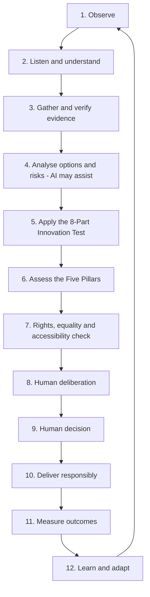

# HESI–5P Responsible AI Continuous Learning Loop

**A human-centred governance cycle for assessing, deploying, monitoring and improving AI systems over time.**

> Working framework v0.3 · 19 August 2026

## Purpose

AI governance should not be treated as a one-off approval exercise. Data changes, models change, people’s needs change, laws and standards evolve, environmental impacts shift, and unexpected harms can emerge after deployment.

The HESI–5P Responsible AI Continuous Learning Loop therefore treats responsible innovation as a repeating cycle:

**Observe → Listen and understand → Gather and verify evidence → Analyse options and risks → Apply the 8-Part Innovation Test → Assess the Five Pillars → Check rights and accessibility → Human deliberation → Human decision → Deliver responsibly → Measure outcomes → Learn and adapt → Repeat**

The central rule is simple:

> Technology provides capability. Evidence informs decisions. Humans remain accountable. The Five Pillars determine whether innovation is genuinely beneficial.

## The loop



## 1. Observe

Identify the need, opportunity, emerging problem or unintended consequence.

Ask:

- What has changed?
- Who is affected?
- Is there a genuine problem to solve?
- Is AI necessary, or could a simpler approach work better?

## 2. Listen and understand

Combine technical evidence with lived experience, professional expertise and community knowledge.

People affected by an AI system should have meaningful opportunities to shape the problem definition, desired outcomes, safeguards and success measures.

A core inclusion principle is:

> AI must adapt to human diversity — people should not have to adapt themselves to AI.

## 3. Gather and verify evidence

Examine the quality and provenance of data, research, assumptions and claims.

Check:

- data quality and representativeness;
- provenance and lawful use;
- uncertainty and missing information;
- bias and unequal coverage;
- conflicts of interest;
- relevant baselines and alternatives; and
- whether the exact system, model, data and deployment context being assessed are identifiable and reproducible.

For traceability, record the AI provider, model or system name, version or release identifier, deployment environment, relevant dataset or knowledge-base version, assessment date and assessment owner. Where a previous review exists, link or reference it so material changes can be identified.

## 4. Analyse options and risks — AI may assist

Risk and options analysis does not require AI. It may be performed by people, technical tools, independent reviewers or a combination of methods.

AI may help organise information, detect patterns, compare scenarios, identify possible risks and support explanation. When AI assists with the assessment of another AI system, its own limitations, provenance and potential conflicts should be recognised.

AI output should be treated as evidence to examine, not as an accountable decision.

Useful partnership principles are:

- **AI handles complexity; humans maintain relationships.**
- **AI provides evidence; humans provide empathy and context.**
- **AI recommends; diverse humans deliberate and decide.**
- **AI connects information; people connect with people.**

## 5. Apply the 8-Part Innovation Test

Assess whether the proposed use of AI is:

1. **Accurate** — Are claims scientifically and technically supported by evidence?
2. **Lawful** — Does the system comply with applicable law, regulation and fundamental rights in every relevant jurisdiction?
3. **Ethical** — Is it fair, safe and aligned with human values? Could it cause harm or injustice?
4. **Inclusive** — Can relevant people and communities access, participate in and benefit from it?
5. **Sustainable** — What are the environmental, resource and lifecycle effects?
6. **Explainable** — Can affected people understand how the system is used, its important limitations and uncertainty?
7. **Accountable** — Who is responsible for decisions and outcomes, and how can they be challenged?
8. **Beneficial** — Does it create real public or user benefit that outweighs risks, harms and costs?

For the lawful assessment, record the relevant jurisdiction or jurisdictions, the organisation’s role in the AI supply or deployment chain, applicable laws or regulations, any relevant legal basis for data processing, and the regulatory or risk classification where one applies.

The strength of evidence and safeguards should be proportionate to the potential impact of the AI system.

## 6. Assess the Five Pillars

| Pillar | Core question | Example considerations |
| --- | --- | --- |
| **People** | Does the AI protect dignity and improve wellbeing fairly? | Safety, accessibility, equality, privacy, education, health, skills, cultural and community effects |
| **Planet** | Does the AI produce a credible environmental net benefit? | Energy, water, carbon, materials, e-waste, biodiversity and resilience |
| **Prosperity** | Does the AI create fair and durable value? | Productivity, decent work, affordability, skills, innovation and distribution of benefits |
| **Peace** | Does the AI strengthen rights, safety and trustworthy institutions? | Rule of law, cybersecurity, privacy, transparency, redress, misuse prevention and public trust |
| **Partnership** | Are affected groups and relevant sectors genuinely involved? | Co-design, communities, government, research, business, civil society, standards and knowledge sharing |

A positive result in one pillar should not conceal serious harm in another.

## 7. Rights, equality and accessibility check

Before a consequential AI-assisted decision, ask:

- Who benefits?
- Who might be excluded or adversely affected?
- Who has not been heard?
- Is the system accessible for different needs?
- Could bias or discrimination affect the result?
- Can a person understand and challenge the decision?
- Is meaningful human contact and support available?
- Are privacy, data protection, safety and security proportionate?

Relevant safeguards may include accessibility-by-design, bias testing, privacy controls, human review, clear explanations, routes for complaint and appeal, and independent scrutiny.

## 8. Human deliberation

People should discuss the evidence, uncertainty, trade-offs and distribution of benefits and harms.

AI may generate or compare options, but it should not replace dialogue between people, communities, professionals and accountable institutions.

## 9. Human decision

A named person or institution should remain responsible for consequential decisions.

The decision record should include:

- evidence considered;
- uncertainty and unresolved questions;
- affected groups and participation;
- Five-Pillar effects;
- safeguards;
- reasons for the decision;
- monitoring requirements;
- review date;
- material-change review triggers;
- stop or pause conditions; and
- challenge or redress routes.

## 10. Deliver responsibly

Implementation should include proportionate safeguards, transparency, human oversight, security and clear responsibility across the supply chain.

High-impact systems should normally be introduced in stages, with pilots and review gates rather than irreversible deployment by default.

## 11. Measure outcomes

Measure what happened in the real world, not only what the model predicted.

Possible indicators include:

- accuracy, reliability and error rates;
- safety incidents;
- accessibility barriers;
- outcome gaps between groups;
- complaints, appeals and successful remedies;
- privacy and security incidents;
- energy, water, carbon and material use;
- affordability and cost per useful outcome;
- workforce effects and skills development;
- stakeholder participation and public confidence.

Results should be disaggregated where lawful, safe and useful for detecting unequal effects.

## 12. Learn and adapt

Use monitoring evidence to:

- correct errors;
- improve accessibility and inclusion;
- change safeguards;
- update data or models;
- retrain staff;
- revise policies;
- redesign the service;
- pause deployment; or
- stop the system when harms cannot be adequately controlled.

The findings then return to **Observe**, beginning the next cycle.

## Why the loop matters

An AI system that passed an assessment previously should not automatically be assumed safe, lawful or beneficial forever.

The loop recognises that:

- data changes;
- models and suppliers change;
- social conditions change;
- laws and standards change;
- new evidence becomes available;
- environmental impacts can change;
- unexpected risks or harms may emerge; and
- public expectations and community needs evolve.

Continuous monitoring therefore becomes part of responsible governance rather than an optional extra.

## Scheduled and event-triggered reassessment

A review should happen at an agreed frequency and also when a material change occurs. Appropriate triggers can include:

- a new model or model version;
- a material change to training, reference or operational data;
- a change of provider, hosting environment or important supplier;
- a new purpose or significant change in how the system is used;
- expansion to new groups, locations or jurisdictions;
- a serious incident, complaint or unexpected outcome;
- a significant cybersecurity vulnerability or threat change;
- a relevant legal, regulatory or standards change; or
- evidence that previous assumptions, safeguards or expected benefits are no longer reliable.

A material-change review should determine whether the existing assessment remains valid or whether the system should be restricted, paused or reassessed before further use.

## Technology-neutral application

The loop is intended to work across different AI systems and providers. It can be applied to generative AI, recruitment systems, healthcare AI, education technology, public-sector systems, environmental applications, transport, humanitarian tools, cybersecurity, autonomous systems and AI combined with quantum computing.

For specialised technology such as quantum computing, an additional rule applies:

> Quantum advantage does not automatically mean human or societal advantage.

A technically superior calculation should still pass the HESI–5P assessment for rights, inclusion, sustainability, accountability and real-world benefit.

## Minimum review record

```markdown
### HESI–5P AI Review

- System or project:
- AI provider:
- Model/system name:
- Model/version or release identifier:
- Deployment context/environment:
- Relevant dataset/knowledge-base version:
- Assessment date:
- Assessment owner/reviewer:
- Previous review reference:
- Purpose and affected groups:
- Current need or observed change:
- Evidence and provenance:
- Alternatives considered, including no AI:
- Jurisdiction(s):
- Organisation role in the AI supply/deployment chain:
- Applicable laws/regulations:
- Data-processing legal basis where relevant:
- Regulatory/risk classification where relevant:
- Accuracy assessment:
- Lawful assessment:
- Ethical assessment:
- Inclusive assessment:
- Sustainable assessment:
- Explainability assessment:
- Accountability assessment:
- Beneficial assessment:
- People impact:
- Planet impact:
- Prosperity impact:
- Peace impact:
- Partnership impact:
- Equality, accessibility and human-rights safeguards:
- Privacy and security safeguards:
- Accountable human decision-maker:
- Decision and reasons:
- Indicators and baseline:
- Monitoring frequency:
- Material-change review triggers:
- Stop or pause conditions:
- Challenge or redress route:
- Next review date:
- Lessons to feed into the next cycle:
```

## Reference basis

This working framework should be used alongside the project’s [reference register](../REFERENCES.md), including current primary and official sources on human rights, equality, accessibility, AI governance, data protection, sustainable development and evaluation. Legal and regulatory requirements must be checked for the relevant jurisdiction and date of use.

## Governing principle

**Observe → Understand → Evidence → Analyse → Test → Assess → Human Decide → Deliver → Measure → Learn → Repeat**

The objective is not simply to make AI more capable. It is to ensure that innovation remains human-centred, evidence-led, sustainable, inclusive and demonstrably beneficial across **People, Planet, Prosperity, Peace and Partnership**.